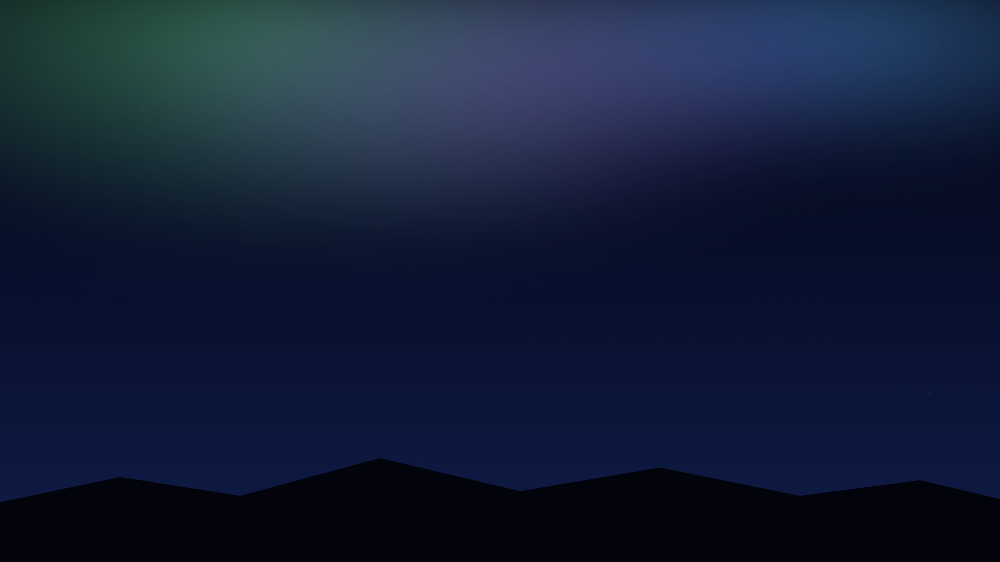
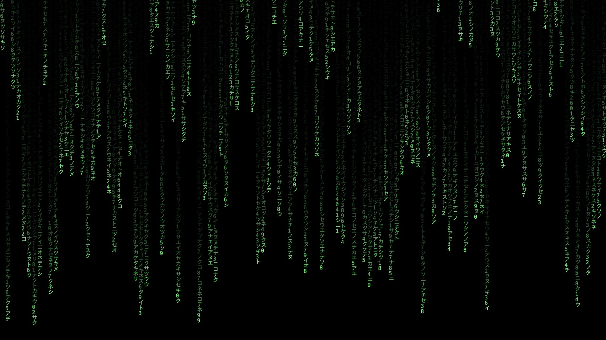

# Wallflow

[](https://www.swift.org)
[](https://www.apple.com/macos/)
[](LICENSE)
[](https://github.com/Jesselrj/Wallflow/releases)

仿 Wallpaper Engine 的 macOS 动态壁纸应用。原生 Swift/AppKit + SwiftUI，菜单栏程序，支持视频、GIF、图片和网页（HTML）四种动态壁纸，支持多显示器独立设置壁纸。

<p align="center">
  
  
</p>

上图为内置示例壁纸 **aurora**（纯 CSS 渐变极光 + 星空）与 **matrix**（Canvas 数字雨），均为实际运行截屏。

## 功能

- **四种壁纸类型**：视频（mp4/mov/m4v，自动循环）、GIF（逐帧解析播放）、图片（png/jpg/heic/webp 等）、网页（HTML，完整 JS/WebGL 动效支持）
- **窗口层级**：壁纸渲染在系统桌面与 Finder 图标层之间，不影响桌面图标点击与拖拽
- **多显示器**：每块屏幕可设置不同壁纸（面板顶部切换"所有显示器/某块屏"），屏幕热插拔与分辨率变化自动重建
- **填充/适应**、**视频静音**、**全局暂停**（合盖/屏幕休眠时自动暂停）
- **开机启动**（SMAppService，app 移动位置后自动刷新注册）、壁纸库持久化（JSON，含分屏分配）
- 首次启动自动导入内置示例壁纸（aurora / matrix）

## 构建与运行

```bash
./build-app.sh          # 产出 Wallflow.app（Release，已 ad-hoc 签名）
open Wallflow.app
```

或者开发模式：

```bash
swift build && swift run
```

要求：macOS 13+，Xcode 命令行工具。

## 分发

```bash
./make-dmg.sh           # 产出 dist/Wallflow-<版本>.dmg（含 Applications 拖拽快捷方式）
```

## 使用

点击菜单栏的相框图标：

- 点选列表中的壁纸立即切换；`+` 按钮添加文件（可多选）
- 右键列表项可移除壁纸
- 多屏时面板顶部出现屏幕选择器：选"所有显示器"则所有屏统一壁纸；选某块屏则只为该屏单独指定（列表中带双屏图标的壁纸已被单独指定）
- 右键列表项可"指定到屏幕"（多屏时），或移除壁纸
- 底部控制条：填充/适应切换、视频静音、全局暂停、开机启动、退出

## 技术说明

- **窗口层级**：`NSWindow.Level = desktopIconWindow - 1`，配合 `.canJoinAllSpaces + .stationary`，让壁纸常驻所有空间且位于图标之下。参考 `WallpaperPanel.swift`。
- **网页壁纸的遮挡修复**：壁纸窗口永远被 Finder 图标层窗口遮挡，WebKit 会把页面标记为 `hidden` 并挂起 `requestAnimationFrame` 与 DOM 定时器，导致 JS 动画壁纸黑屏。Wallflow 通过 WKWebView 私有 API `_setWindowOcclusionDetectionEnabled:` 及若干节流开关绕过（见 `WebWallpaperRenderer.swift`），方法不存在时静默跳过。私有 API 意味着不能上架 App Store，自用与分发 DMG 没有问题。
- **视频**：`AVQueuePlayer` + `AVPlayerLooper` 无缝循环。
- **GIF**：ImageIO 全帧解码 + 每帧原始时长驱动的定时器，避免 NSImageView 不支持动图的问题。

## 目录结构

```
Sources/Wallflow/
├── WallflowApp.swift          # 入口，MenuBarExtra
├── LibraryView.swift          # 菜单栏面板 UI
├── Wallpaper.swift            # 数据模型
├── LibraryStore.swift         # 壁纸库持久化
├── WallpaperManager.swift     # 多屏窗口管理与生命周期
├── Screens.swift              # 屏幕稳定标识（UUID）与名称
├── WallpaperPanel.swift       # 桌面层级窗口
├── Renderers.swift            # 渲染器协议与工厂
├── VideoWallpaperRenderer.swift
├── FrameSequenceWallpaperRenderer.swift   # GIF/图片
├── WebWallpaperRenderer.swift
└── Examples/                  # 内置示例壁纸
```

## License

MIT
